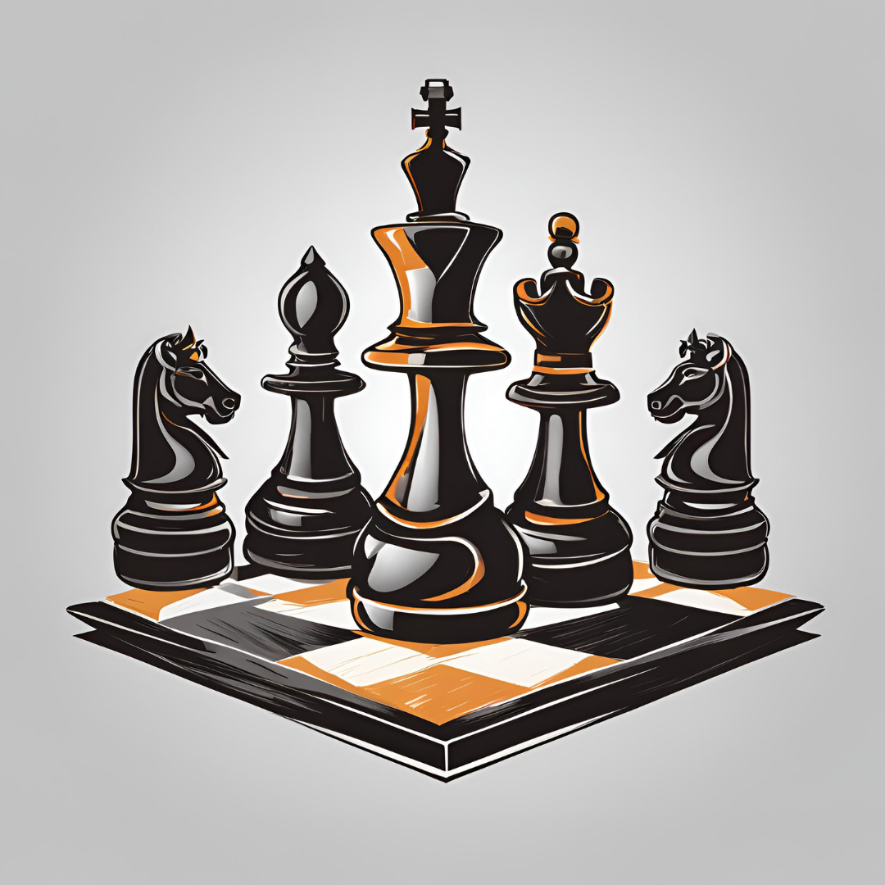

# Awesome Social Chess

## Table of Contents

- [Books](#books)
- [Calendars](#calendars)
- [Cards](#cards)

## Books

- **101 Questions On How To Play Chess** - Fred Wilson - Dover Game And Puzzle Activity Books
- **Bobby Fischer Teaches Chess** - Bobby Fischer, Stuart Margulies, Donn Mosenfelder - Basic Systems Inc, Bantam Books
- **Chess Openings For Dummies** - James Eade - For Dummies
- **Learn Chess: A Gold-medal Winner Explains How to Play and Win at Chess** - John Nunn - Gambit Publications Ltd
- **Learn Chess From The Greats** - Peter J. Tamburro, Jr. - Dover Publications
- **My System** - Winning Chess Strategies - Aron Nimzowitsch - SnowBall Publishing
- **The Usborne Complete Book of Chess** - Elizabeth Dalby - Usborne Publishing Ltd

## Calendars

- American Chess Magazine Chess 2024 - A Year of Chess Puzzles

## Cards

- Chess Endgame Cards general - Benoni 1: Standard size playing cards
- The Chess Deck - 50 Cards For Mastering The Basics - Levy Rozman AKA GOTHAMCHESS: Large deck of cards
